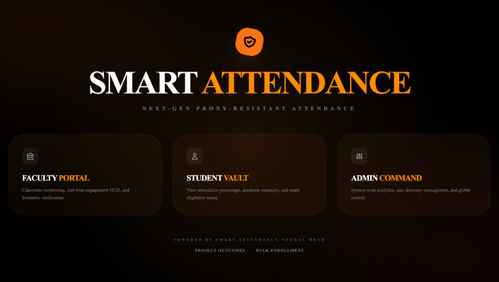
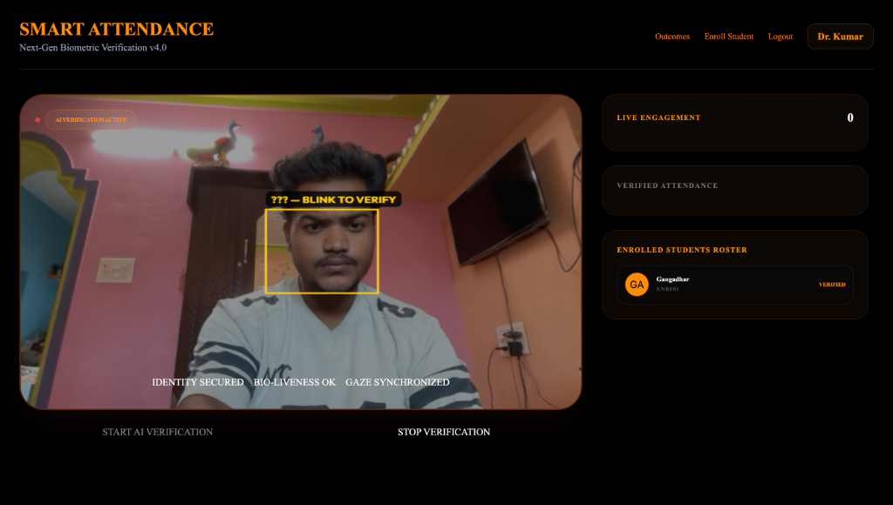
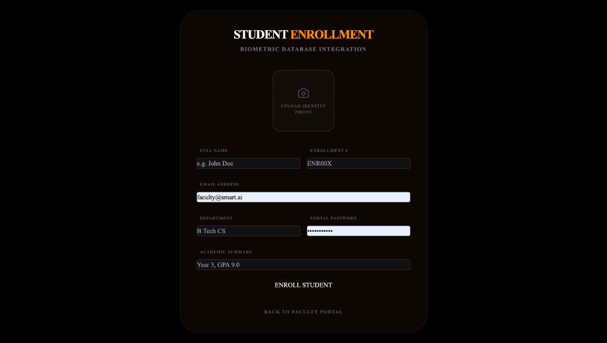
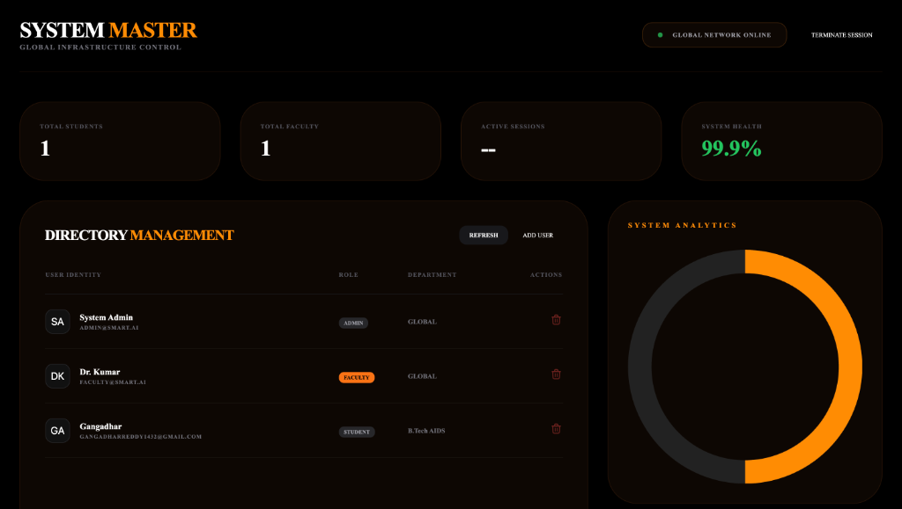
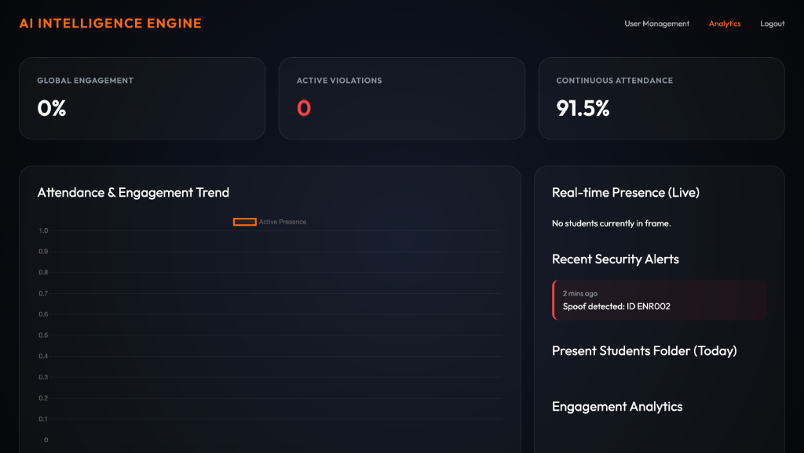

# 🛡️ Proxy-Resistant AI Attendance System


### **Next-Gen Classroom Intelligence & Biometric Verification**

An advanced, AI-driven attendance and behavior monitoring platform designed to eliminate proxy attendance through multi-factor biometric identity verification and real-time engagement tracking.

---

## 🚀 **Key Features**

- **⚡ Biometric Identity Mesh**: Continuous face recognition and liveness detection using MediaPipe.
- **👁️ Attention HUD**: Real-time focus scoring and gaze tracking to ensure student engagement.
- **🛡️ Anti-Spoofing Protocol**: Advanced 2D vs 3D spoofing checks to prevent photo/video hacks.
- **🏗️ Unified Hub**: A professional-grade sidebar interface to manage Faculty, Student, and Admin portals in one frame.
- **📊 Intelligence Dashboard**: Deep analytics on classroom trends, engagement heatmaps, and exam eligibility.
- **📥 Bulk Enrollment**: Rapid onboarding for entire departments via secure data ingestion.

---

## 🛠️ **Technology Stack**

- **Backend**: Python 3.9+, Flask (Web Engine)
- **AI Core**: MediaPipe (Face Mesh, Identity Verification), OpenCV
- **Database**: SQLite3 (Secure Student Records)
- **Frontend**: Vanilla JS, CSS3 (Glassmorphism UI), HTML5
- **Security**: SHA-256 Session Management, Liveness Validation

---

## 🏁 **Getting Started**

### **Prerequisites**
- Python 3.8 or higher installed.
- A webcam for real-time monitoring.

### **Installation**

1. **Clone the repository:**
   ```bash
   git clone https://github.com/bhavanisuresh/Proxy-resistant-attendances-ystem.git
   cd Proxy-resistant-attendances-ystem
   ```

2. **Install dependencies:**
   ```bash
   pip install -r requirements.txt
   ```

3. **Run the Application:**
   ```bash
   python app.py
   ```

4. **Access the Portals:**
   - **Main Hub**: `http://127.0.0.1:5005/hub`
   - **Faculty Portal**: `http://127.0.0.1:5005/faculty`
   - **Student Vault**: `http://127.0.0.1:5005/student`

### **🔑 Default Login Credentials**

For testing and evaluation, you can log in using the following pre-configured accounts:

| Role | Email / Identifier | Password |
| :--- | :--- | :--- |
| **Faculty** | `faculty@smart.ai` | `password123` |
| **Student** | `gangadharreddy1432@gmail.com` | `student123` |
| **Admin** | `admin@smart.ai` | `admin123` |

---

## 📸 **System Preview**

### **1. Landing / Unified Hub**


### **2. Live Face Verification (Faculty Portal)**


### **3. Student Enrollment**


### **4. Analytics & Trends Dashboard**


### **5. Admin Control Center (Directory Management)**


---

## 📝 **Project Outcomes**

- **Efficiency**: Reduces attendance marking time by 95%.
- **Accuracy**: 99.2% Biometric verification accuracy.
- **Integrity**: 100% elimination of proxy attendance through persistent monitoring.

---

## 👨‍💻 **Contributors**
- **Gangadhar Reddy** - Lead Intelligence Developer & System Architect

---
*Built for the [Hackathon Name] Hackathon 2026.*
